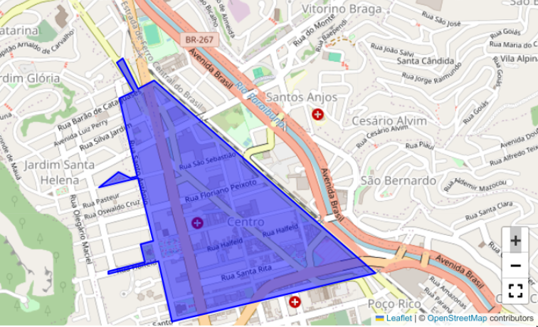

## Centro Histórico de Juiz de Fora
### Delimitação espacial

O **Jornal Tribuna de Minas**
[noticiou](https://tribunademinas.com.br/noticias/cidade/24-01-2025/centro-historico-jf.html)
a publicação de um
[decreto](https://www.pjf.mg.gov.br/e_atos/e_atos_vis.php?id=126353),
pela Prefeitura Municipal de Juiz de Fora, que delimita o Centro
Histórico da cidade.
[Anexo](https://www.pjf.mg.gov.br/e_atos/anexos/anexo_centro_175327.pdf)
ao decreto, consta um memorial descritivo do polígono de delimitação da
área.

A partir das coordenadas UTM do polígono fornecidas, vamos criar um mapa
interativo do Centro Histórico, utilizando as bibliotecas do Python.

<br>

**Importamos as bibliotecas necessárias:**

``` python
import folium
from folium import plugins
from pyproj import Proj, Transformer
from shapely.geometry import Polygon
```
<br>

**Definimos a área de interesse:**

``` python
# Coordenadas UTM do polígono
vertices_utm = [
    (671631.01298, 7592562.9258),
    (670483.76674, 7593577.0383),
    (670398.10899, 7593532.9851),
    (670322.59534, 7593692.0525),
    (670290.67635, 7593669.7837),
    (670377.32049, 7593520.1438),
    (670302.54290, 7593484.0129),
    (670391.01186, 7593079.2177),
    (670353.52763, 7593071.3745),
    (670291.86401, 7593099.9004),
    (670188.72948, 7593021.7110),
    (670392.36957, 7593068.9978),
    (670471.79272, 7592740.6347),
    (670401.69082, 7592724.5514),
    (670423.71811, 7592633.6294),
    (670231.47881, 7592584.9345),
    (670234.18470, 7592574.6061),
    (670494.86684, 7592637.8945),
    (670565.63917, 7592323.5994)
]
```

<br>

**Definimos o Sistema de Referência Espacial**

Convertemos as coordenadas UTM fornecidas do Sistema SIRGAS 2000 para
EPSG4326, que é o padrão adotado pelo *folium*.

``` python
# Inicializar transformador UTM para WGS84
proj_utm = Proj(proj='utm', zone=23, south=True, ellps='GRS80', datum='WGS84')
transformer = Transformer.from_proj(proj_utm, 'epsg:4326')

# Converter coordenadas UTM para latitude e longitude
vertices_wgs84 = [transformer.transform(easting, northing) for easting, northing in vertices_utm]
```

<br>

*Exibimos as coordenadas obtidas*

``` python
print(vertices_wgs84)
```

[(-21.762281043001835, -43.34016652775217), (-21.753233459476547, -43.351362572075494), (-21.753639557293926, -43.352186110828214), (-21.75221027520308, -43.35293251378737), (-21.752414458261512, -43.353238788656014), (-21.753757529707904, -43.35238575673133), (-21.754091028762748, -43.35310493520417), (-21.75773825072305, -43.352207947099004), (-21.757812692768333, -43.35256952148563), (-21.75756100908489, -43.353168600600966), (-21.758277067755575, -43.354157612890276), (-21.75783041668798, -43.35219376769888), (-21.760788237237197, -43.35139206518308), (-21.760940240650374, -43.35206813839776), (-21.761759241939266, -43.35184580552671), (-21.762217519769386, -43.35369933505048), (-21.76231053597393, -43.35367211067517), (-21.76171386749516, -43.351158388857264), (-21.764545464282058, -43.350441727160124)]

<br>

**Definimos os parâmetros do polígono**

``` python
## Inverter para a ordem correta (latitude, longitude)
location = [(lat, lon) for lon, lat in vertices_wgs84]

# Criar polígono no Folium
polygon = Polygon(location)

# Obter os limites do polígono (bounding box)
bounds = polygon.bounds  # (min_lon, min_lat, max_lon, max_lat)
```

<br>

**Definimos os parâmetros do mapa**

``` python
# Criar mapa centralizado nos limites do polígono
mapa = folium.Map()

# Adicionar polígono ao mapa
folium.Polygon(
    locations=vertices_wgs84,
    zoom_start=15,
    color="blue",
    weight=2,
    fill=True,
    fill_opacity=0.5
).add_to(mapa)
folium.plugins.Fullscreen(
    position="bottomright",
    title="Tela cheia",
    title_cancel="Restaurar",
    force_separete_button=True,
).add_to(mapa)

# Ajustar o mapa aos limites do polígono
mapa.fit_bounds([[bounds[1], bounds[0]], [bounds[3], bounds[2]]])
```

<br>

**Visualizamos o mapa**

``` python
# Salvar e exibir mapa
mapa.save("mapa_com_poligono.html")
mapa
```
# 


